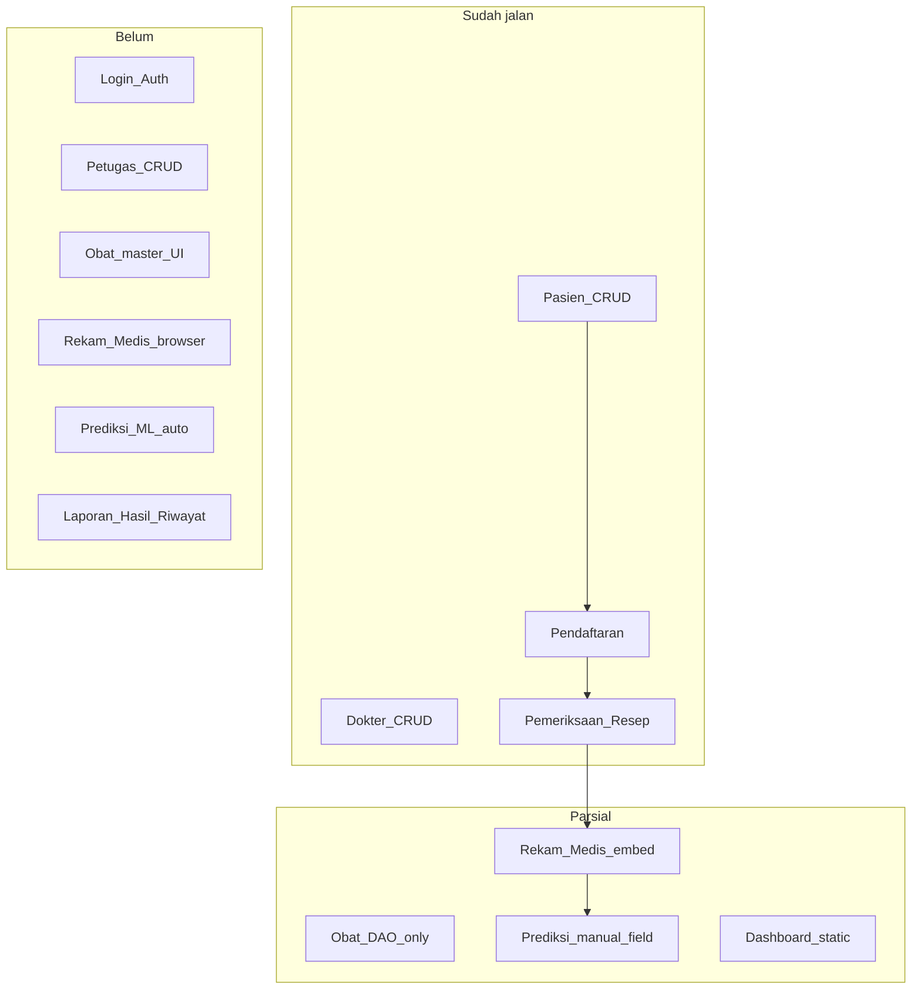
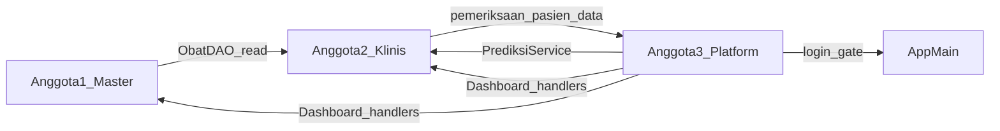
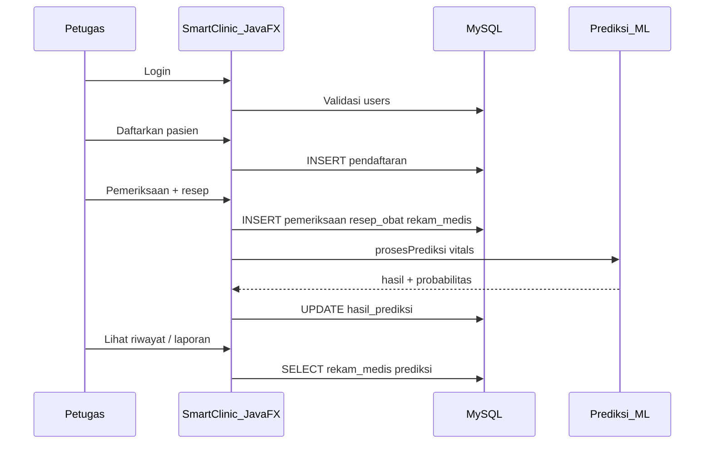

# Smart Clinic — Analisis Fitur & Pembagian Tim

Dokumen ini merangkum fitur wajib proyek **Sistem Klinik Cerdas dengan Prediksi Machine Learning** berdasarkan diagram kelas ([class_diagra,.png](../class_diagra,.png)), alur sistem ([ket.txt](../ket.txt)), dan source code saat ini.

---

## 1. Ringkasan Sistem

| Aspek | Keterangan |
|-------|------------|
| **Nama proyek** | Smart Clinic (Klinik Cerdas) |
| **Frontend** | JavaFX + FXML |
| **Backend** | Java (OOP): Model → Service → DAO → MySQL |
| **Database** | MySQL (`smart_clinic`) — skema di [smartClinic.sql](../smartClinic.sql) |
| **AI/ML (rencana diagram)** | Python (Scikit-learn) via integrasi fase 2; fase 1 bisa rule-based Java (`Prediksi`) |
| **Entry point** | [AppMain.java](../src/AppMain.java) → `dashboard.fxml` (belum ada login) |

### Alur bisnis utama

```
Pasien Datang → Pendaftaran → Pemeriksaan Dokter → Rekam Medis → Prediksi ML → Hasil & Riwayat
```

### Fitur utama (dari diagram & UI dashboard)

1. Manajemen Pasien  
2. Manajemen Dokter  
3. Pendaftaran & Antrian  
4. Rekam Medis  
5. Prediksi Kesehatan (ML)  
6. Laporan & Dashboard  
7. Manajemen Obat & Resep (mendukung pemeriksaan)  
8. Autentikasi pengguna (Admin / Petugas)

---

## 2. Entitas dari Diagram Kelas

Mapping class diagram → implementasi di codebase:

| Class diagram | File model | Peran di sistem | Integrasi DB/UI |
|---------------|------------|-----------------|-----------------|
| **User** | `src/model/User.java` | Login, role, logout | Parsial — model saja; tabel `users`, `roles` ada di SQL |
| **Pasien** | `src/model/Pasien.java` | Data pasien + vitals | Selesai — CRUD penuh |
| **Dokter** | `src/model/Dokter.java` | Data dokter | Selesai — CRUD penuh |
| **Klinik** | `src/model/Klinik.java` | Agregat klinik | Belum — in-memory, tidak dipakai UI |
| **Pendaftaran** | `src/model/Pendaftaran.java` | Antrian / daftar periksa | Selesai — CRUD penuh |
| **Pemeriksaan** | `src/model/Pemeriksaan.java` | Kunjungan, diagnosa, vitals | Selesai — CRUD + resep |
| **RekamMedis** | `src/model/RekamMedis.java` | Ringkasan rekam per pemeriksaan | Parsial — disimpan dari flow pemeriksaan |
| **Obat** | `src/model/Obat.java` | Master obat | Parsial — DAO ada, UI master belum |
| **ResepObat** | `src/model/ResepObat.java` | Baris resep | Parsial — hanya di form pemeriksaan |
| **Prediksi** | `src/model/Prediksi.java` | Hasil prediksi risiko | Parsial — rule Java; tidak dipanggil dari UI |
| **Predictable** | `src/model/Predictable.java` | Interface `prosesPrediksi()` | Ada — diimplementasi `Prediksi` |
| **Person** | `src/model/Person.java` | Base class Pasien/Dokter | Ada |
| **DatabaseManager** (diagram) | `src/database/DBConnection.java` | Koneksi MySQL | Ada — nama berbeda, fungsi sama |
| **MLService** (diagram) | — | Bridge ke model Python | Belum — rencana Anggota 3 |

**Catatan legacy:** `Pendaftaran2.java` adalah demo console, tidak dipakai aplikasi — abaikan saat development.

---

## 3. Daftar Fitur Wajib

Fitur dikelompokkan per modul agar selaras dengan sidebar [dashboard.fxml](../src/view/dashboard.fxml).

### 3.1 Infrastruktur & Keamanan

| ID | Fitur | Deskripsi |
|----|-------|-----------|
| F-01 | Koneksi database | MySQL via `DBConnection.connect()` |
| F-02 | Login | Validasi user/password ke tabel `users` |
| F-03 | Logout | Keluar aplikasi, kembali ke layar login |
| F-04 | Role-based access | Batasi menu berdasarkan role (Admin, Petugas, dll.) |
| F-05 | Manajemen petugas | CRUD akun petugas (tabel `users` + `roles`) |

### 3.2 Master Data

| ID | Fitur | Deskripsi |
|----|-------|-----------|
| F-10 | CRUD Pasien | Tambah, ubah, hapus, cari pasien + validasi |
| F-11 | CRUD Dokter | Tambah, ubah, hapus, cari dokter |
| F-12 | CRUD Obat | Master obat: nama, stok, harga |

### 3.3 Transaksi Klinis

| ID | Fitur | Deskripsi |
|----|-------|-----------|
| F-20 | Pendaftaran | Daftarkan pasien ke dokter (tanggal, keluhan) |
| F-21 | Antrian | Tampilkan daftar pendaftaran (status antrian opsional) |
| F-22 | Pemeriksaan | Input vitals, diagnosa, catatan |
| F-23 | Resep obat | Tambah/hapus obat pada pemeriksaan, cetak resep |
| F-24 | Rekam medis | Simpan & tampil riwayat rekam per pasien |

### 3.4 Prediksi & Laporan

| ID | Fitur | Deskripsi |
|----|-------|-----------|
| F-30 | Prediksi ML | Hitung risiko dari data pasien/pemeriksaan (gula darah, dll.) |
| F-31 | Simpan hasil prediksi | Persist ke `pemeriksaan.hasil_prediksi` atau tabel prediksi |
| F-32 | Dashboard | Statistik pasien, kunjungan, prediksi (data real, bukan placeholder) |
| F-33 | Hasil & riwayat | Gabungan rekam medis + prediksi per pasien |
| F-34 | Laporan klinik | Ringkasan/cetak laporan operasional |

### 3.5 OOP & Diagram (non-fungsional akademik)

| ID | Fitur | Deskripsi |
|----|-------|-----------|
| F-40 | Inheritance `Person` | Pasien & Dokter extends Person |
| F-41 | Interface `Predictable` | Prediksi implements `prosesPrediksi()` |
| F-42 | Layered architecture | Controller → Service → DAO → Model |
| F-43 | Agregat `Klinik` | Kelola koleksi pasien/dokter (opsional integrasi UI) |

---

## 4. Status Implementasi

Legenda: **Selesai** | **Parsial** | **Belum**

| Modul | Fitur (ID) | Status | Bukti di codebase |
|-------|------------|--------|-------------------|
| Infrastruktur | F-01 | **Selesai** | `DBConnection.java` |
| Autentikasi | F-02, F-03, F-04 | **Belum** | `User.login()` in-memory; tidak ada `login.fxml`, `UserDAO` |
| Petugas | F-05 | **Belum** | Tombol `btnPetugas` tanpa `onAction`; tidak ada DAO |
| Pasien | F-10 | **Selesai** | `PasienController`, `PasienDAO`, `PasienService`, `pasien.fxml` |
| Dokter | F-11 | **Selesai** | `DokterController`, `DokterDAO`, `DokterService`, `dokter.fxml` |
| Obat | F-12 | **Parsial** | `ObatDAO`, `ObatService` lengkap; **tanpa** `obat.fxml` / controller |
| Pendaftaran | F-20, F-21 | **Selesai** | `PendaftaranController`, `PendaftaranDAO`; `PendaftaranService.search()` return `null` |
| Pemeriksaan | F-22, F-23 | **Selesai** | `PemeriksaanController`, `PemeriksaanDAO`, resep + cetak |
| Rekam medis | F-24 | **Parsial** | Insert/update via `PemeriksaanDAO`; **tanpa** layar browse |
| Prediksi ML | F-30, F-31 | **Parsial** | Field teks manual di form; `Prediksi.prosesPrediksi()` tidak dipanggil UI |
| Dashboard | F-32 | **Parsial** | Angka statis (245, 1240, …); `TableView` kosong |
| Hasil & riwayat | F-33 | **Belum** | Tombol di sidebar tanpa handler |
| Laporan | F-34 | **Belum** | Tombol tanpa handler |
| Klinik | F-43 | **Belum** | `Klinik.java` hanya demo console |
| OOP | F-40–F-42 | **Selesai** | Struktur paket `model`, `service`, `dao`, `controller` |

### Matriks UI ↔ Backend

| Layar | FXML | Controller | DAO | Service | CRUD |
|-------|------|------------|-----|---------|------|
| Dashboard | `dashboard.fxml` | `DashboardController` | — | — | Navigasi saja |
| Pasien | `pasien.fxml`, `form_pasien.fxml` | Ya | Ya | Ya | Lengkap |
| Dokter | `dokter.fxml`, `form_dokter.fxml` | Ya | Ya | Ya | Lengkap |
| Pendaftaran | `pendaftaran.fxml`, `form_pendaftaran.fxml` | Ya | Ya | Ya | Lengkap |
| Pemeriksaan | `pemeriksaan.fxml`, `form_pemeriksaan.fxml` | Ya | Ya | Ya | Lengkap |
| Obat | — | — | Ya | Ya | Backend saja |
| Rekam medis | — | — | Via PemeriksaanDAO | — | Embed saja |
| Login / Petugas / Laporan | — | — | — | — | Tidak ada |

### Diagram status fitur



---

## 5. Backlog Pengembangan

Prioritas agar aplikasi selaras diagram kelas dan UI dashboard.

### Prioritas tinggi (Sprint 1)

| # | Task | Owner rekomendasi | Keterangan |
|---|------|-------------------|------------|
| B-01 | Layar login + ubah `AppMain` | Anggota 3 | Gate aplikasi sebelum dashboard |
| B-02 | `UserDAO` + `UserService` | Anggota 3 | Query tabel `users` / `roles` |
| B-03 | UI master Obat (`obat.fxml`) | Anggota 1 | Sidebar `btnObat` sudah ada |
| B-04 | Fix `PendaftaranService.search()` | Anggota 2 | Saat ini return `null` |
| B-05 | Wire `btnRekam` → layar rekam medis | Anggota 2 | Browse/filter by pasien |

### Prioritas menengah (Sprint 2)

| # | Task | Owner rekomendasi | Keterangan |
|---|------|-------------------|------------|
| B-06 | CRUD Petugas | Anggota 3 | Manfaatkan seed SQL `petugas/123` |
| B-07 | Dashboard statistik real | Anggota 3 | Query COUNT dari DAO |
| B-08 | Prediksi otomatis saat simpan pemeriksaan | Anggota 3 + hook di Anggota 2 | Panggil `PrediksiService` |
| B-09 | Validasi `DokterService` | Anggota 1 | Selaraskan dengan `PasienService` |

### Prioritas rendah / fase 2 (Sprint 3)

| # | Task | Owner rekomendasi | Keterangan |
|---|------|-------------------|------------|
| B-10 | Integrasi Python ML (`MLService`) | Anggota 3 | Sesuai diagram: Scikit-learn |
| B-11 | Layar Hasil & Riwayat | Anggota 3 | Gabung rekam + prediksi |
| B-12 | Laporan klinik (export/cetak) | Anggota 3 | PDF atau print JavaFX |
| B-13 | Status antrian pendaftaran | Anggota 2 | Kolom `status` di DB + UI |
| B-14 | Integrasi model `Klinik` | Opsional | Agregat OOP di dashboard |

### Technical debt

- Hapus atau dokumentasikan `Pendaftaran2.java` sebagai legacy.
- Tabel `prediksi` awal di SQL tidak dipakai; aplikasi memakai `pemeriksaan.hasil_prediksi`.
- `Dokter.periksaPasien()` / `buatDiagnosa()` masih `println` — bisa diarahkan ke flow pemeriksaan atau dihapus dari demo.

---

## 6. Pembagian Tim (3 Orang)

**Prinsip:** pembagian **vertical slice per domain** (bukan per layer), agar tiap anggota memiliki modul end-to-end dan minim bentrok file yang sama.

### Anggota 1 — Master Data & Farmasi

**Sidebar:** Pasien, Dokter, Obat

#### Jobdesk

- Maintain modul **Pasien** dan **Dokter** (bugfix, validasi, UX).
- Bangun modul **Obat** lengkap (FXML + Controller + wiring dashboard).
- Tambah validasi bisnis di `DokterService` (konsisten dengan `PasienService`).
- Dokumentasi API `ObatDAO` untuk dipakai modul pemeriksaan.

#### Tanggung jawab

| Area | Detail |
|------|--------|
| Domain | `Pasien`, `Dokter`, `Obat`, `Person` |
| Layer | Controller, Service, DAO, FXML master data |
| Database | Tabel `pasien`, `dokter`, `obat` |
| Testing | CRUD tiap master + search |

#### File ownership (utama)

```
src/controller/PasienController.java
src/controller/FormPasienController.java
src/controller/DokterController.java
src/controller/FormDokterController.java
src/controller/ObatController.java          ← baru
src/controller/FormObatController.java    ← baru
src/dao/PasienDAO.java
src/dao/DokterDAO.java
src/dao/ObatDAO.java
src/service/PasienService.java
src/service/DokterService.java
src/service/ObatService.java
src/view/pasien.fxml
src/view/form_pasien.fxml
src/view/dokter.fxml
src/view/form_dokter.fxml
src/view/obat.fxml                          ← baru
src/view/form_obat.fxml                     ← baru
```

#### Checklist sprint

- [ ] `obat.fxml` + form modal ( pola sama `pasien.fxml` )
- [ ] `DashboardController.openObat()` atau koordinasi dengan Anggota 3 untuk satu baris `onAction`
- [ ] Validasi insert/update dokter di service layer
- [ ] Uji dropdown obat di form pemeriksaan setelah data obat diisi

#### Hindari mengedit

`Pemeriksaan*`, `Pendaftaran*`, `login*`, `UserDAO`, statistik dashboard.

---

### Anggota 2 — Alur Klinis (Transaksi)

**Sidebar:** Pendaftaran, Pemeriksaan, Rekam Medis

#### Jobdesk

- Maintain **Pendaftaran** dan **Pemeriksaan** (termasuk resep & cetak).
- Perbaiki **search pendaftaran** di service layer.
- Bangun **layar Rekam Medis** (baca riwayat, filter pasien, detail per kunjungan).
- Opsional: status antrian (menunggu / selesai / batal).

#### Tanggung jawab

| Area | Detail |
|------|--------|
| Domain | `Pendaftaran`, `Pemeriksaan`, `RekamMedis`, `ResepObat` |
| Layer | Controller, Service, DAO transaksi, FXML alur klinis |
| Database | `pendaftaran`, `pemeriksaan`, `rekam_medis`, `resep_obat` |
| Testing | Alur: daftar → periksa → resep → rekam tersimpan |

#### File ownership (utama)

```
src/controller/PendaftaranController.java
src/controller/FormPendaftaranController.java
src/controller/PemeriksaanController.java
src/controller/FormPemeriksaanController.java
src/controller/RekamMedisController.java       ← baru
src/dao/PendaftaranDAO.java
src/dao/PemeriksaanDAO.java
src/dao/ResepObatDAO.java
src/dao/RekamMedisDAO.java                     ← baru (jika dipisah)
src/service/PendaftaranService.java
src/service/PemeriksaanService.java
src/view/pendaftaran.fxml
src/view/form_pendaftaran.fxml
src/view/pemeriksaan.fxml
src/view/form_pemeriksaan.fxml
src/view/rekam_medis.fxml                      ← baru
```

#### Checklist sprint

- [ ] Fix `PendaftaranService.search()` → delegasi ke DAO
- [ ] `rekam_medis.fxml` + tabel riwayat + filter pasien
- [ ] Wire `btnRekam` di dashboard (via Anggota 3 atau PR kecil)
- [ ] Satu hook di `FormPemeriksaanController` untuk prediksi (panggilan service dari Anggota 3)
- [ ] Uji delete pemeriksaan (cascade rekam & resep)

#### Hindari mengedit

`Obat.fxml`, `PasienDAO` logic, `login*`, `UserDAO`, `Prediksi*`, `AppMain`.

---

### Anggota 3 — Platform, Keamanan, ML & Laporan

**Sidebar:** Dashboard (data), Petugas, Prediksi ML, Hasil & Riwayat, Laporan Klinik, Logout

#### Jobdesk

- **Login / logout** + session user aktif.
- **CRUD Petugas** (manajemen `users`).
- **Prediksi ML** — fase 1: `Prediksi` + `PrediksiService`; fase 2: `MLService` + Python.
- **Dashboard** — statistik dari database (bukan angka hardcoded).
- **Laporan** & **Hasil & Riwayat**.
- Own **`DashboardController`** untuk handler menu yang belum ada.

#### Tanggung jawab

| Area | Detail |
|------|--------|
| Domain | `User`, `Prediksi`, `Predictable`, `Klinik` |
| Layer | Login, platform, laporan, integrasi ML |
| Database | `users`, `roles`; konsumsi DAO lain untuk laporan |
| Testing | Login gagal/berhasil, role, prediksi tersimpan, angka dashboard |

#### File ownership (utama)

```
src/AppMain.java
src/controller/DashboardController.java
src/controller/LoginController.java            ← baru
src/controller/PetugasController.java          ← baru
src/controller/FormPetugasController.java      ← baru
src/controller/PrediksiController.java           ← baru (opsional)
src/controller/LaporanController.java          ← baru
src/dao/UserDAO.java                           ← baru
src/service/UserService.java                   ← baru
src/service/PrediksiService.java               ← baru
src/service/MLService.java                     ← baru (fase 2)
src/util/SessionManager.java                   ← baru (opsional)
src/view/login.fxml                            ← baru
src/view/dashboard.fxml                        (area statistik & handler)
src/view/petugas.fxml                          ← baru
src/view/laporan.fxml                          ← baru
src/model/User.java
src/model/Prediksi.java
src/model/Klinik.java
```

#### Checklist sprint (bertahap)

**Fase A — Platform**

- [ ] `login.fxml` + `UserDAO` + ubah `AppMain` load login dulu
- [ ] Session: simpan user login, wire tombol Logout
- [ ] `btnPetugas` → CRUD petugas

**Fase B — Dashboard & laporan**

- [ ] Query COUNT pasien, pendaftaran hari ini, pemeriksaan, prediksi
- [ ] Layar Hasil & Riwayat
- [ ] Laporan klinik (minimal tabel + print)

**Fase C — ML**

- [ ] `PrediksiService.predict(Pasien)` — wrap `Prediksi.prosesPrediksi()`
- [ ] Koordinasi dengan Anggota 2: panggil saat simpan pemeriksaan
- [ ] (Opsional) Python script + `MLService`

#### Hindari mengedit

Logic dalam `PemeriksaanDAO`, `PasienDAO`, form CRUD pasien/dokter/obat.

---

### Diagram dependensi antar anggota



### Estimasi beban kerja

| Anggota | Modul selesai | Modul baru utama | Tingkat kesulitan |
|---------|---------------|------------------|-------------------|
| 1 | Pasien, Dokter | Obat UI + polish | Sedang |
| 2 | Pendaftaran, Pemeriksaan | Rekam Medis UI + fix search | Sedang–tinggi |
| 3 | — | Login, Petugas, Dashboard, ML, Laporan | Tinggi (boleh fase A→C) |

---

## 7. Aturan Kolaborasi Anti-Konflik

### 7.1 Ownership file

| Aturan | Keterangan |
|--------|------------|
| Satu owner per file | Perubahan file milik anggota lain hanya lewat PR + review |
| `DashboardController` | **Anggota 3** mengelola; Anggota 1/2 minta tambah `onAction` (1–2 baris) |
| `AppMain.java` | **Anggota 3** saja (entry login) |
| `smartClinic.sql` | Satu orang per sprint merge skema, atau file `docs/migrations/anggotaN.sql` |

### 7.2 Branch & merge

```
main
 ├── feat/obat-ui          (Anggota 1)
 ├── feat/rekam-medis      (Anggota 2)
 ├── feat/login-platform   (Anggota 3)
 └── feat/prediksi-ml      (Anggota 3, setelah login)
```

- Merge ke `main` hanya jika modul bisa di-run (tidak break compile).
- Pull `main` sebelum mulai hari development.

### 7.3 Kontrak antarmodul (jangan ubah sembarangan)

| API | Owner | Consumer | Catatan |
|-----|-------|----------|---------|
| `ObatDAO.getData()` | Anggota 1 | Anggota 2 (form pemeriksaan) | Jangan ubah signature tanpa diskusi |
| `PasienDAO`, `DokterDAO` | Anggota 1 | Anggota 2 (combo pendaftaran) | Read-only dari sisi Anggota 2 |
| `PrediksiService.predict(Pasien)` | Anggota 3 | Anggota 2 (1 baris di form simpan) | Didefinisikan dulu di branch Anggota 3 |
| `SessionManager.getCurrentUser()` | Anggota 3 | Semua (opsional menu by role) | |

### 7.4 Urutan integrasi (disarankan)

1. **Login shell** (Anggota 3) — `AppMain` → login → dashboard  
2. **Master Obat + Petugas** (Anggota 1 & 3) — sidebar lengkap  
3. **Rekam Medis UI** (Anggota 2) — `btnRekam` aktif  
4. **Prediksi otomatis** (Anggota 3 service + hook Anggota 2)  
5. **Dashboard & Laporan** (Anggota 3) — statistik real  

### 7.5 Komunikasi tim

- Daily sync 5 menit: file apa yang disentuh hari ini.  
- Konflik di `dashboard.fxml`: Anggota 3 merge, yang lain kirim potongan FXML/handler.  
- Issue database: satu koordinator SQL per sprint.

---

## 8. Diagram Alur Klinik (End-to-End)



---

## Referensi Cepat

| Dokumen | Path |
|---------|------|
| Diagram kelas | [class_diagra,.png](../class_diagra,.png) |
| Alur sistem | [ket.txt](../ket.txt) |
| Skema database | [smartClinic.sql](../smartClinic.sql) |
| Cara menjalankan app | [README.md](../README.md) |

---

*Dokumen dibuat untuk mendukung pengembangan paralel 3 developer. Perbarui status di Section 4 setelah setiap sprint selesai.*
